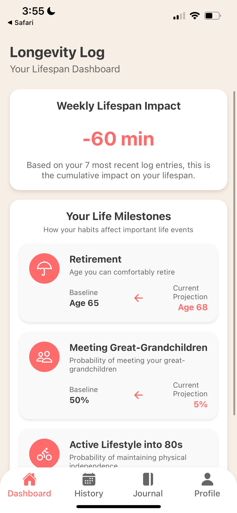
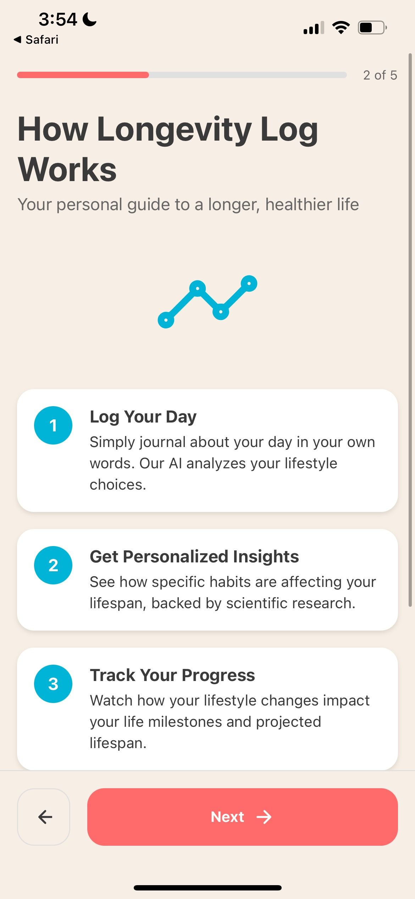
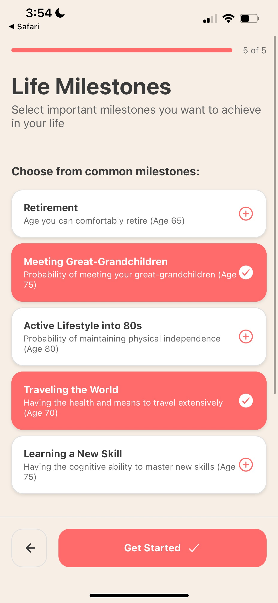
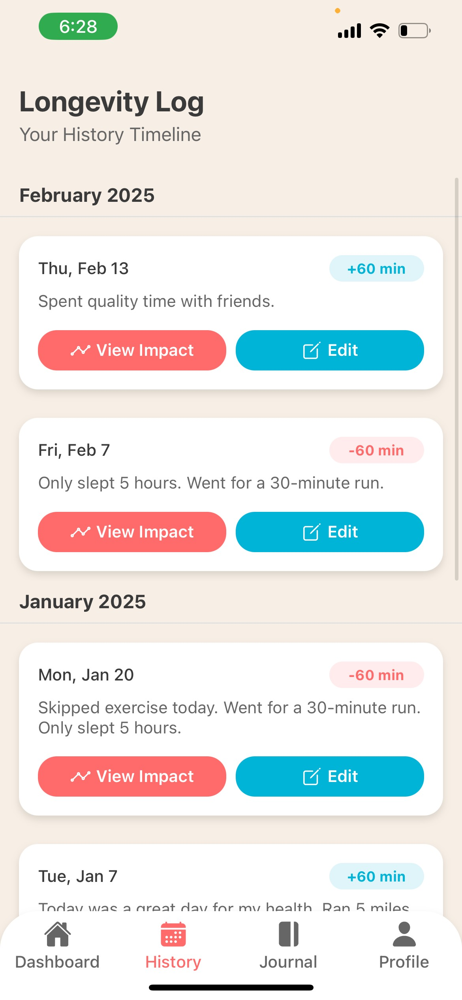
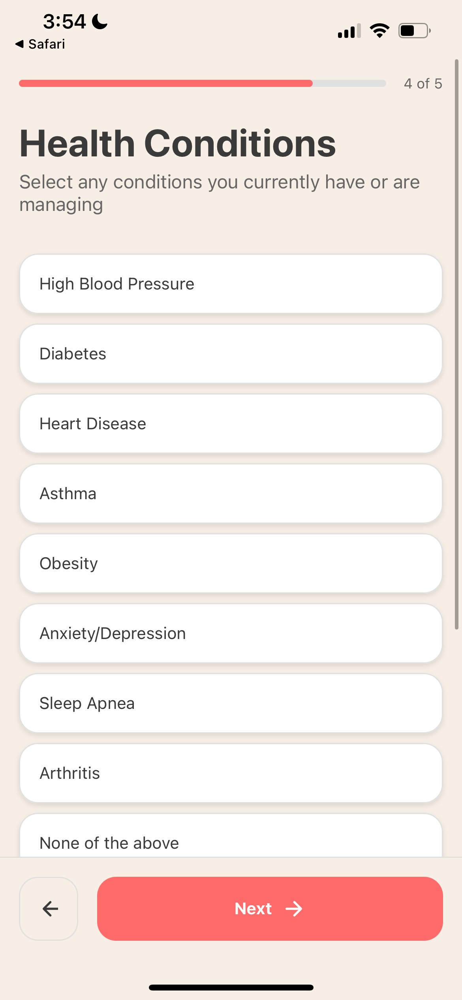

# WhatsKillingMe - Longevity Tracking App

A React Native Expo application that helps users track and understand how their daily lifestyle choices impact their lifespan.



## 📱 Features

- **Daily Lifestyle Logging**: Record your daily activities and habits
- **AI-Powered Analysis**: Get insights on how your lifestyle choices affect your lifespan
- **Impact Visualization**: See both immediate and long-term effects of your habits
- **Lifespan Timeline**: Visual representation of your projected lifespan trajectory
- **Life Milestones**: Track how your habits affect important life milestones
- **Personalized Recommendations**: Receive actionable suggestions to improve your longevity
- **History Tracking**: Review past entries and track your progress over time

## 🚀 Technology Stack

- React Native
- Expo
- TypeScript
- Google Gemini API for AI analysis
- AsyncStorage for local data persistence

## 📋 Prerequisites

- Node.js (v14 or newer)
- npm or yarn
- Expo CLI
- Android Studio (for Android development)
- Xcode (for iOS development, macOS only)

## 🛠️ Installation

1. Clone the repository:
   ```bash
   git clone https://github.com/MDavis3/whatskillingme.git
   cd whatskillingme
   ```

2. Install dependencies:
   ```bash
   npm install
   # or
   yarn install
   ```

3. Start the development server:
   ```bash
   npx expo start
   ```

4. Follow the instructions in the terminal to open the app on your device or emulator.

## 📊 How It Works

1. **Log Your Day**: Enter a description of your day, including activities, diet, sleep, etc.
2. **AI Analysis**: Our AI analyzes your entry to identify lifestyle factors
3. **Impact Calculation**: See the direct impact (seconds/minutes) and long-term impact (years) on your lifespan
4. **Recommendations**: Get personalized suggestions to improve your habits
5. **Track Progress**: Monitor how your lifestyle changes affect your projected lifespan over time

## 📸 Screenshots








## 🤝 Contributing

Contributions are welcome! Please feel free to submit a Pull Request.

## 📄 License

This project is licensed under the MIT License - see the LICENSE file for details.

## 🙏 Acknowledgements

- [Expo](https://expo.dev/)
- [React Native](https://reactnative.dev/)
- [Google Gemini API](https://ai.google.dev/)
- All the contributors who have helped shape this project 